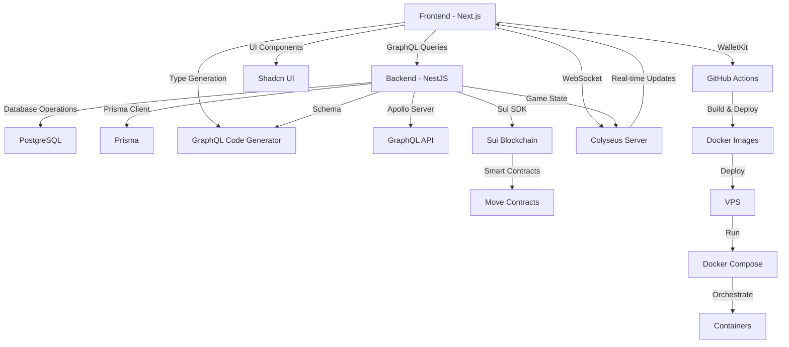

# System Patterns: Relic of Lies

## Architecture Overview
- Monorepo structure with Next.js frontend and NestJS backend
- GraphQL API for flexible data querying
- PostgreSQL database with Prisma ORM
- Colyseus real-time game server
- Sui blockchain integration
- Smart contract game logic
- Docker-based deployment with GitHub Actions CI/CD
- VPS hosting with Docker Compose orchestration

## Core Components

### Frontend (Next.js)
- Wallet connection and management
- Game room creation and joining
- Real-time game interface
- Card playing interface
- Game state visualization
- Staking and reward display
- Responsive design with Shadcn UI

### Backend (NestJS)
- Game room management
- Player authentication
- Game state validation
- Smart contract integration
- Real-time communication
- Database operations
- Game session management

### Smart Contracts (Move)
- Game contract for match management
- Staking and reward distribution
- Commit-reveal verification
- Player state management

### Real-time Server (Colyseus)
- WebSocket connections
- Game state synchronization
- Player turn management
- Action broadcasting
- Room management

## Data Models

### Game
- Room ID and status
- Player list and order
- Current round and turn
- Staking amount
- Game state and history

### Player
- Wallet address
- Game participation
- Commit hash and salt
- Revealed cards
- Points and elimination status

### GameSession
- Round management
- Move history
- Player actions
- Round outcomes

### Move
- Player actions
- Card plays
- Target selections
- Timestamps

## Design Patterns
- Repository pattern for data access
- Service layer for business logic
- GraphQL resolvers for API
- Real-time updates with Colyseus
- CQRS for complex operations
- Blockchain event listeners
- Game state manager
- Wallet connection manager

## Security Patterns
- Wallet-based authentication
- Commit-reveal anti-cheat
- Input validation
- Rate limiting
- Data encryption
- Smart contract security
- Game state verification

## Integration Points
- Colyseus game server
- Email notification service
- Sui blockchain network
- Wallet providers
- Move standard library
- Sui framework

## Component Relationships


## Code Organization
```
relic-of-lies/
├── apps/
│   ├── web/          # Next.js frontend
│   │   ├── src/
│   │   └── codegen.ts # GraphQL Code Generator config
│   ├── api/          # NestJS backend
│   │   ├── src/
│   │   │   ├── dynamic-modules/  # Dynamic module configurations
│   │   │   ├── games/           # Game module
│   │   │   ├── players/         # Player module
│   │   │   ├── blockchain/      # Blockchain integration
│   │   │   └── app.module.ts    # Root module
│   └── contract/    # Move smart contracts
│       ├── sources/  # Contract source files
│       │   ├── relic_of_lies.move   # Main contract module
│       │   ├── game.move        # Game logic
│       │   └── staking.move     # Staking and rewards
│       ├── tests/    # Contract tests
│       │   ├── game_tests.move  # Game contract tests
│       │   └── staking_tests.move # Staking contract tests
│       └── Move.toml # Contract configuration
├── package.json      # Root package configuration
└── memory-bank/      # Project documentation
```

## Key Technical Decisions
1. Monorepo structure for better code sharing and management
2. Apollo Server for GraphQL implementation
3. Prisma for database operations
4. TypeScript for type safety across the stack
5. Shadcn UI for consistent design system
6. GraphQL Code Generator for type-safe GraphQL operations
7. Sui blockchain for game logic and staking
8. WalletKit for wallet integration
9. Move language for smart contracts
10. Colyseus for real-time game server
11. Modular contract design for better maintainability

## Architecture Patterns

### Module Structure
- Each feature has its own module
- Modules contain:
  - Resolvers (GraphQL)
  - Services (Business Logic)
  - DTOs (Data Transfer Objects)
  - Entities (Database Models)

### Game System
- GraphQL-first approach
- Input validation using class-validator
- Service layer for business logic
- Prisma for database operations
- Error handling with custom exceptions
- Real-time state synchronization

### Staking System
- Smart contract integration
- Transaction state management
- Status flow: PENDING → ACTIVE → COMPLETED
- Error handling for failed transactions

### Real-time Integration
- Colyseus room management
- WebSocket communication
- Game state synchronization
- Player action broadcasting
- Error recovery

## Implementation Patterns

### GraphQL Patterns
- Input types for mutations
- Response types for queries
- Field resolvers for relationships
- Error handling with custom types

### Service Patterns
- Dependency injection
- Transaction management
- Error handling
- Logging
- Validation

### Frontend Patterns
- Component composition
- State management
- Form handling
- Error boundaries
- Loading states

## Testing Strategy

### Backend Testing
- Unit tests for services
- Integration tests for resolvers
- E2E tests for API endpoints
- Mock Sui transactions

### Frontend Testing
- Component tests
- Integration tests
- E2E tests
- Mock API responses

### Contract Testing
- Move unit tests
- Integration tests
- Property-based testing
- Formal verification

## Error Handling

### Backend Errors
- Custom exception filters
- GraphQL error types
- Transaction rollback
- Error logging

### Frontend Errors
- Error boundaries
- Toast notifications
- Form validation
- Loading states

### Contract Errors
- Custom error types
- Transaction rollback
- Error recovery
- State validation

## Security Patterns

### Authentication
- JWT tokens
- Wallet verification
- Session management

### Authorization
- Resource ownership
- Game state validation
- Transaction signing

### Anti-Cheat
- Commit-reveal mechanism
- Salt validation
- State verification
- Transaction integrity

## Performance Patterns

### Backend
- Query optimization
- Caching
- Batch operations
- Connection pooling

### Frontend
- Code splitting
- Lazy loading
- Image optimization
- Caching

### Real-time
- WebSocket optimization
- State synchronization
- Action batching
- Connection management

## Deployment Patterns

### Backend
- Docker containers
- Environment variables
- Database migrations
- Health checks

### Frontend
- Static generation
- API routes
- Environment configuration
- Build optimization

### Contracts
- Automated deployment
- Verification
- Network management
- Upgrade mechanisms

## Code Organization

### Backend Structure
```
apps/api/src/
├── games/
│   ├── dto/
│   │   ├── create-game.input.ts
│   │   └── join-game.input.ts
│   ├── entities/
│   │   └── game.entity.ts
│   ├── games.module.ts
│   ├── games.resolver.ts
│   └── games.service.ts
├── players/
│   ├── dto/
│   │   ├── create-player.input.ts
│   │   └── update-player.input.ts
│   ├── entities/
│   │   └── player.entity.ts
│   ├── players.module.ts
│   ├── players.resolver.ts
│   └── players.service.ts
└── blockchain/
    ├── dto/
    │   └── stake.input.ts
    ├── blockchain.module.ts
    ├── blockchain.resolver.ts
    └── blockchain.service.ts
```

### Frontend Structure
```
apps/web/src/
├── components/
│   ├── game/
│   │   ├── GameRoom.tsx
│   │   ├── GameTable.tsx
│   │   └── CardHand.tsx
│   ├── lobby/
│   │   ├── CreateRoom.tsx
│   │   ├── JoinRoom.tsx
│   │   └── RoomList.tsx
│   └── wallet/
│       ├── WalletConnect.tsx
│       ├── WalletInfo.tsx
│       └── StakeAmount.tsx
└── pages/
    ├── game/
    │   ├── index.tsx
    │   └── [roomId].tsx
    ├── lobby/
    │   ├── index.tsx
    │   └── create.tsx
    └── wallet/
        ├── index.tsx
        └── connect.tsx
``` 